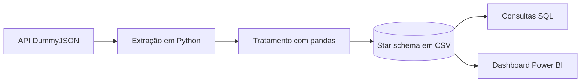

# Análise de Vendas - E-commerce

Projeto pessoal pra praticar um fluxo de dados completo: puxar dados de uma API, tratar em Python, modelar, consultar em SQL e montar um dashboard no Power BI.

Os dados são fictícios. Vêm da API pública [DummyJSON](https://dummyjson.com) e simulam as vendas de uma loja online (produtos, clientes e carrinhos de compra).

## Tecnologias

- Python (requests, pandas, numpy)
- SQL (SQLite)
- Power BI (modelagem em DAX)

## Como funciona

O script puxa os dados da API e organiza tudo num modelo estrela: uma tabela de fatos (`fato_vendas`) ligada a três dimensões (`dim_produtos`, `dim_clientes` e `dim_calendario`). Esse formato deixa as consultas mais diretas no SQL e o modelo mais leve no Power BI.



## Estrutura

```
.
├── README.md
├── requirements.txt
├── src/
│   ├── pipeline_dados.py      # extração + tratamento
│   └── carregar_sqlite.py     # carrega o star schema no SQLite
├── sql/
│   └── consultas.sql          # queries (inclui window functions)
├── dados/
│   └── tratados/              # star schema gerado
├── powerbi/
│   ├── dashboard.pbix
│   └── tema.json
└── docs/
    └── img/
        ├── dashboard_desktop.png
        └── dashboard_mobile.png
```

## Como rodar

```bash
pip install -r requirements.txt

# baixa da API, trata e gera o star schema em dados/tratados/
python src/pipeline_dados.py

# carrega os CSVs num banco SQLite
python src/carregar_sqlite.py

# roda as consultas
sqlite3 vendas.db < sql/consultas.sql
```

Se preferir, dá pra abrir o `vendas.db` no DB Browser for SQLite e rodar as queries por lá. Os CSVs em `dados/tratados/` também já servem direto pra importar no Power BI.

## Algumas decisões pelo caminho

A API não traz a data dos pedidos, e sem data não dá pra fazer análise temporal nenhuma. Resolvi gerando uma data por pedido no Python, com seed fixa pra ficar reprodutível e uma leve tendência de crescimento pra não ficar um padrão artificial. A partir daí montei a dimensão calendário.

Na hora de validar, apareceram alguns pedidos apontando pra clientes que não existem na base (chave estrangeira órfã). Em vez de simplesmente apagar, deixei a validação reportar isso e usei LEFT JOIN pra esses casos não sumirem - dá pra ver o problema na própria tabela.

Os valores de faturamento (bruto, desconto e líquido) eu recalculei no Python em vez de confiar nos campos já somados da API, só pra garantir que tudo fecha.

## Dashboard

Desktop:


Mobile:


## Observação

As métricas e cálculos do dashboard foram feitos em DAX, dentro do Power BI. O SQL deste repositório cobre a mesma análise pela ótica de consulta na fonte - serve pra mostrar as duas abordagens.
